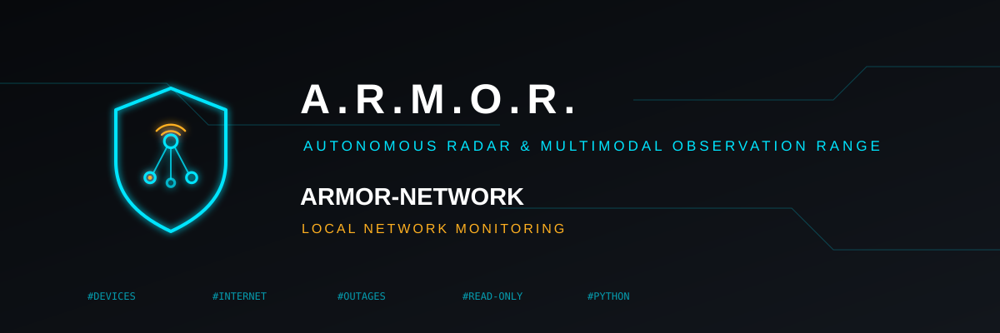

<p align="center">
  
</p>

# 🛰️ ARMOR-NETWORK

<p align="center">
  🇺🇸 <b>English</b> |
  <a href="README_spa.md">🇪🇸 Español</a> |
  <a href="README_fra.md">🇫🇷 Français</a> |
  <a href="README_ita.md">🇮🇹 Italiano</a> |
  <a href="README_deu.md">🇩🇪 Deutsch</a> |
  <a href="README_zho.md">🇨🇳 简体中文</a> |
  <a href="README_jpn.md">🇯🇵 日本語</a>
</p>

### Watches the local network: the devices on it, whether the internet is there, what changes and what is new (a Python program with no dependencies, read-only; it runs on a machine of the network and reports to ARMOR-SERVER)

<p align="center">
  
  
  
  
  
</p>

---

**Honesty check - what runs today:** **Maturity: scaffolding.** The scanner, the inventory that tells what changed, the internet check and the message are tested on a computer against a scripted network (53 tests; every message is accepted by ARMOR-COMMON's contract), and the program has been run once on a real network, which had a router and a phone on it. It has not watched a whole house for days, it only asks the router and never configures it, and what a device is (its kind, its system, its maker) is a guess. It does not capture packets: it cannot see who talks to whom, and traffic per device and intrusion detection in the strict sense need the router's counters or a mirror port, which is a later step.

---

## 🎯 Overview

* **What is on the network:** the neighbour table of the machine, a poke of every address so that it fills, an echo to each device found (latency and TTL) and what devices announce about themselves (mDNS, UPnP, NetBIOS, reverse DNS). For each device: address, MAC, maker (from the IEEE register of 40,000 blocks), name, kind, system, open ports with what each says, and when it was first and last seen.
* **Ports:** a TCP connection to 17 (or 44) ports of each device, twelve at a time, reading at most a few hundred bytes of what answers; never a login, never an exploit. A new device is looked at at once, the others every quarter of an hour.
* **What changes:** a device that appears (the first scan only learns), goes quiet or comes back, changes its address, a port that opens or closes, and two machines answering for one address (the router's above all). Every event has an id, so it is told once.
* **The internet:** every few seconds an echo to the router, a TCP connection, two DNS questions to chosen resolvers and a web page. An outage takes three rounds to be called one and two to be over, is dated from its first failed round and counted to the first good one, and says whose fault it is: the provider's (the router answers and nothing beyond it does) or this side's (the router does not answer either). Latency, loss and the outages of the last 24 hours.
* **On request:** an operator can ask from Studio for a sweep now, a ping, a traceroute, a wake-up packet, the ports or the web page of one device, or to inspect its administration page with the login kept for it (its model, its firmware, whether it still has a factory login). The orders arrive in the answer to the node's own message; the node never listens, only private addresses on its own network are touched, and nothing on a device is changed.
* **It only looks at your own network:** it refuses any address that is not private (10/8, 172.16/12, 192.168/16) and any range larger than a /22; a skip list keeps it away from what is fragile; nothing is sent to a device that is not a question.
* **The message** `armor/network/<node>/state`: the interface, the internet, every device and the latest events; it is in the shared contract (330 vectors) and carries findings, never commands. `python -m armor_network scan` prints it as a table, `watch` tells ARMOR-SERVER, `demo` plays a made-up house (a new device joins, a camera opens Telnet, the internet falls and comes back, someone answers for the router) without touching any network.
* **Where it shows:** the Network menu of ARMOR-STUDIO (the devices, the internet with its outages and latency, the traffic and the events; an administrator names devices and marks the known ones, which quiets the alarm of a new device), the Network Designer (the drawing of the house's network, compared with what was found, and able to draw it) and the Network screen of the Android app. ARMOR-SERVER raises the alarms.
* **Not yet:** the router's own counters (traffic per device), packet capture, controlling anything (blocking a device, closing a port, changing the router) and weeks on a real network.

## 📂 Repository Structure

```text
ARMOR-NETWORK/
├── src/armor_network/  ipnet (what may be probed), oui (makers), neighbors + parsers + dnswire (what the system and the devices say), services (ports and guesses), inventory (devices and their events),
│                       internet (the outage state machine), agent (what to look at and how often), system_io (the real network), sim_io (a scripted one), publisher, cli
│   └── data/           oui.tsv.gz, the IEEE register of makers
├── tools/              fetch_oui.py
├── tests/              test_network.py
├── docs/               DESIGN, SAFETY, USAGE, MESSAGES
└── images/             brand assets
```

## 🛠️ Development Environment

```bash
python -m unittest discover -s tests                  # 53 tests: the parsers with real samples, the guard on what may be probed, the inventory, the internet, the whole agent against a scripted house
python -m armor_network scan                          # look at the network once and print it (only the private network of this machine)
python -m armor_network watch --server-url http://127.0.0.1:8080 --ingest-token ...    # keep watching and tell ARMOR-SERVER
python -m armor_network demo --count 3                # a made-up house: nothing on any network is touched
python tools/fetch_oui.py                             # refresh the table of makers from the IEEE register (run by a person, now and then)
```

See the [usage](docs/USAGE.md) and the [design](docs/DESIGN.md).

See the [design](docs/DESIGN.md), the [safety notes](docs/SAFETY.md), the [usage](docs/USAGE.md) and the [messages](docs/MESSAGES.md).

## 🔗 Related Projects

**A.R.M.O.R.** (Autonomous Radar & Multimodal Observation Range) is a perimeter-security system made of independent repositories. Each one has its own version, its own tests and its own README; this is the family:

* **[ARMOR-COMMON](https://github.com/JuanenRac/ARMOR-COMMON)** - Message contracts, validators, conformance vectors and generated types
* **[ARMOR-RADAR](https://github.com/JuanenRac/ARMOR-RADAR)** - Field-node firmware for ESP32-S3 with three radars and its own web panel
* **[ARMOR-SOLAR](https://github.com/JuanenRac/ARMOR-SOLAR)** - Solar inverter and battery protocols and the messages of a gateway node
* **[ARMOR-ELECTRICAL](https://github.com/JuanenRac/ARMOR-ELECTRICAL)** - Electrical node: meters, the message of the network's readings and the rules for switching
* **[ARMOR-HMI](https://github.com/JuanenRac/ARMOR-HMI)** - Touch panel: the state of the system on a wall screen, arming and acknowledging, and the home of the voice assistant
* **ARMOR-NETWORK** (this repository) - The local network: its devices, the internet and what changes
* **[ARMOR-SERVER](https://github.com/JuanenRac/ARMOR-SERVER)** - Central coordinator: telemetry, alarms, devices, solar readings and cameras
* **[ARMOR-STUDIO](https://github.com/JuanenRac/ARMOR-STUDIO)** - Web console: cameras, radar, alarms, solar energy and the 2D/3D site designer
* **[ARMOR-ANDROID-CONTROL](https://github.com/JuanenRac/ARMOR-ANDROID-CONTROL)** - Android operator client with a live 2D/3D radar
* **[ARMOR-SERVER-AI](https://github.com/JuanenRac/ARMOR-SERVER-AI)** - Visual inference policy that explains its decisions and never actuates
* **[ARMOR-VOICE-AI](https://github.com/JuanenRac/ARMOR-VOICE-AI)** - Offline voice intents with a confirmation that cannot be forged
* **[ARMOR-HARDWARE](https://github.com/JuanenRac/ARMOR-HARDWARE)** - Enclosures, electronics and the bench acceptance matrix
* **[ARMOR-DEVOPS](https://github.com/JuanenRac/ARMOR-DEVOPS)** - Deployment, the CM5 test bench, backup and TLS
* **[ARMOR-SIMULATOR](https://github.com/JuanenRac/ARMOR-SIMULATOR)** - Offline telemetry simulator with repeatable faults
* **[ARMOR-UPDATER](https://github.com/JuanenRac/ARMOR-UPDATER)** - Detects, installs and updates the ecosystem's own repositories
* **[ARMOR-DOCS](https://github.com/JuanenRac/ARMOR-DOCS)** - Architecture, security baseline and the capability matrix

## 📚 Documentation & Community

Where to read more:

* [Capability matrix: what is proven and what is not](https://github.com/JuanenRac/ARMOR-DOCS/blob/main/docs/CAPABILITY_MATRIX.md)
* [Project catalogue: versions and how the repositories depend on each other](https://github.com/JuanenRac/ARMOR-DOCS/blob/main/docs/PROJECT_CATALOG.md)
* [Changelog of this repository](CHANGELOG.md)
* [License (GPL-3.0-or-later)](LICENSE)
* Questions, ideas and reports: electrohobby3d@gmail.com

## 👤 AUTHOR

**JuanenRac (Electro Hobby 3D)** · electrohobby3d@gmail.com

## 📜 LICENSE

GPL-3.0-or-later - see [LICENSE](LICENSE).
